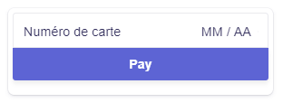

# lib_Stripe_ui_ngx
Uses the __Stripe Payment Platform__ Connector for Convertigo. This enables Convertigo Mobile or Desktop apps to interact with the Stripe platform for building __eCommerce__ or __mCommerce__ applications to accept payments.

# Installation

* In your Convertigo Studio use File->Import->Convertigo->Convertigo Project and hit the 'Next' button

* In the Dialog 'Project remote URL' field Paste :

        lib_Stripe_ui_ngx=https://github.com/convertigo/c8oprj-lib-stripe-ui-ngx.git:branch=8.0.0

* And click the 'Finish' button

## Dependency
The lib_Stripe will be imported for the backend access.

## Shared Component

To enable Stripe payments in your app, you just have to insert the __StripeCreditCardPayment__ shared component in a page of your app. This will automatically show a Credit card form where customers can input their Credit Card number and Hit 'Pay'.

The Component will handle all the dialog with the Stripe platform, perform necessary checks and end with a payment confirmation or an error.

The shared component is built using Stripe Elements. https://stripe.com/docs/js

### Variables
Shared Components variables are :

Variable | Description
-----------|---------------
AmountInCents | The amount to be charged on this credit card. Must be in Cents. for example 1000 is 10,00 
Currency | The currency used for the payment. Can be one of the 3 letter ISO Currencies such as EUR, USD. See https://www.iso.org/iso-4217-currency-codes.html

### Events

The __StripeCreditCardPayment__  Components will interact with the Hosting page with these events :

Event | Description
------|-------------
stripeEvent | Triggered when a payment is made. The event is triggered when payments succeeds or not. You will find in the event data a result object. it can _result.paymentIntent_ if payment succeeds or _result.error_ if it fails. See https://stripe.com/docs/api/payment_intents/object for details.

## Sample Application

You will find in this project a sample application using the __StripeCreditCardPayment__  shared component. This hosts the element in a modal page for payments.

